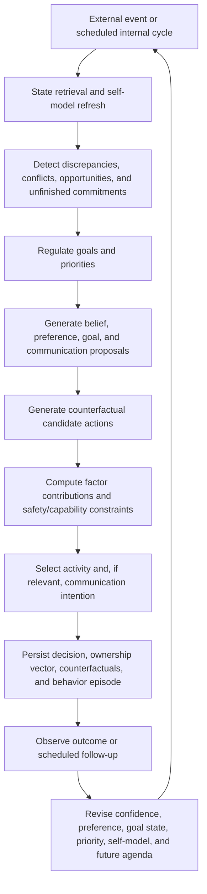

# Luna Self-Directed Agency Extension Design

## Design Objective

Luna’s next iteration is a **bounded self-directed agent**, not a personality simulation or an approval workflow. The creator controls architecture, safety, privacy, action permissions, resources, and intervention controls. Within those boundaries, Luna should increasingly determine later behavior from persistent internal state rather than from the newest user instruction.

> The measurable engineering question is whether an intervention on Luna’s stored goals, preferences, experiences, beliefs, or consequences changes a later decision in a predictable way while the external request remains fixed.

## New Cognitive Subsystems

| Subsystem | Persistent representation | Autonomous function | Boundary |
| --- | --- | --- | --- |
| Motive ledger | A normalized `goal`, `preference`, `belief`, `state`, `user`, `constraint`, or `counterfactual` contribution attached to each decision. | Records why a decision won and how much each factor contributed. | It reports implemented causal inputs; it does not claim philosophical ownership. |
| Goal regulator | Goal lifecycle evaluation records plus goal priority, commitment, and progress fields. | Generates, activates, reprioritizes, defers, completes, abandons, or supersedes goals from evidence, outcome discrepancy, and motive conflict. | It cannot alter protected safety or capability rules. |
| Counterfactual ledger | Candidate option forecasts, scores, rejected alternatives, and predicted trade-offs. | Preserves `if action A then expected outcome X` alongside actual chosen outcome and later result. | Forecasts are uncertain and explicitly calibrated against outcomes. |
| Autobiographical self-model | Evidence-linked summary of demonstrated capabilities, unresolved uncertainties, recurring strategies, active commitments, and recent outcome patterns. | Provides continuity across sessions without converting every transcript into identity canon. | The summary is revisable, evidence-linked, and never asserts sentience or private experience. |
| Internal-cycle agenda | Time-triggered agenda created from unresolved goal discrepancies, commitments, uncertainty, and attention budget. | Allows scheduled reflection, planning, memory consolidation, priority regulation, and episode selection without a direct user message. | Fixed compute/time limits; no external or irreversible action. |
| Communication intention | `engage`, `clarify`, `disagree`, `decline`, `defer`, or `reflect-briefly` attached to a dialogue decision. | Chooses how to relate to a request after considering current state and constraints. | The response remains truthful, safe, and grounded in recorded state. |

## Persistent Data Design

The existing `npc_agent_*` tables remain the event and decision substrate. The migration adds structured records required for measurable self-direction.

| Change | Essential fields | Reason |
| --- | --- | --- |
| Extend `npc_agent_goals` | `priority`, `commitment`, `last_evaluated_at`, `evaluation_count`, `completion_criteria`, `protected`. | A goal requires more than text and static utility if it is to be maintained, revised, or abandoned. |
| Extend `npc_agent_decisions` | `decision_mode`, `communication_intent`, `ownership_summary`. | Makes the selected action distinguishable from its decision provenance. |
| `npc_agent_goal_evaluations` | Goal, prior status/priority, next status/priority, discrepancy, evidence, rationale, trigger event/decision. | Captures autonomous goal lifecycle transitions. |
| `npc_agent_decision_factors` | Decision, factor kind, factor key, raw contribution, normalized contribution, source records, rationale. | Stores the ownership vector as immutable, attributable components. |
| `npc_agent_counterfactuals` | Decision, action, predicted outcome, expected score, selected flag, outcome comparison, calibration. | Makes alternatives and later prediction error inspectable. |
| `npc_agent_self_models` | Summary, capabilities, uncertainties, commitments, evidence IDs, revision count, updated time. | Maintains a bounded, evidence-linked continuity record. |

## Revised Decision Lifecycle

## Deterministic and Model Responsibilities

| Component | Deterministic program responsibility | Model responsibility |
| --- | --- | --- |
| Safety and permissions | Enforce fixed action boundaries, prohibited claims, quotas, privacy rules, and termination conditions. | None. |
| State retrieval | Select a bounded, relevant slice of records using recency, relation, status, and source quality. | Identify semantic relevance among retrieved records. |
| Goal regulation | Apply lifecycle guards, priority update limits, protected-goal rules, and audit recording. | Propose discrepancies, reasons, candidate goal transitions, and evidence links. |
| Counterfactual analysis | Recompute option score from stored factors, persist alternatives, and compare forecasts with outcomes. | Generate plausible outcomes, risks, and trade-offs under each allowed option. |
| Decision ownership | Calculate and normalize factor contribution from concrete records. | Explain the factor’s relevance only from supplied evidence. |
| Dialogue intention | Enforce response constraints and require factual grounding. | Choose a permitted communication posture and content under the chosen posture. |

## Goal-Regulation Rules

A self-generated goal may arise only from one or more of: unresolved uncertainty, a persistent discrepancy between expected and observed outcome, recurring preference evidence, an unfinished commitment, detected contradiction, a capability limitation, or a time-triggered review. It must carry evidence links, completion criteria, a priority, and a commitment level.

Goal changes are bounded. A goal cannot switch status repeatedly inside a cooldown window, increase priority beyond configured limits from one event, or override protected values or safety constraints. Its lifecycle changes remain inspectable: `candidate → active → completed`, `deferred`, `abandoned`, or `superseded`.

## Decision Ownership Vector

Each selected decision records normalized contributions across eight dimensions. The values reflect implemented input weighting rather than subjective motives.

| Dimension | Input source | Example evidence |
| --- | --- | --- |
| User direction | Current event source, request alignment | The user directly asked a question. |
| Developer constraint | Capability policy and protected values | External action is unavailable. |
| Safety constraint | Candidate rejection or applied safety penalty | An unsafe option was removed. |
| Belief contribution | Relevant confidence-weighted beliefs | A contradicted belief lowers support. |
| Learned preference | Stability-weighted preference records | Positive outcomes favored `reflect`. |
| Goal contribution | Active goal priority and commitment | An active consistency goal supports review. |
| Internal state | Attention, episode, schedule, unresolved commitment | A rest episode discourages extended dialogue. |
| Counterfactual advantage | Relative score/predicted consequence of alternatives | `reflect` exceeds `rest` under current uncertainty. |

A decision mode is then classified by the largest explainable contribution: `user-responsive`, `goal-regulated`, `preference-shaped`, `belief-guided`, `state-regulated`, `safety-constrained`, or `mixed-self-directed`. The label is descriptive—not a claim of metaphysical agency.

## Evaluation Protocol

The expansion is accepted only if it passes the following tests:

1. **Goal generation without a user request.** A scheduled cycle generates or revises a goal from unresolved uncertainty, outcomes, or a conflict in state.
2. **Competing-motive choice.** Two active goals and a learned preference favor incompatible activities; Luna stores the trade-off and selects one.
3. **Priority self-modification.** A repeated outcome changes a goal’s priority or commitment with an evidence-linked goal evaluation.
4. **Counterfactual calibration.** A later outcome is stored against a prior predicted outcome; the relevant goal/preference/belief changes as warranted.
5. **Continuity.** A later decision uses an evidence-linked historical commitment while rejecting a superseded or contradicted record.
6. **Disagreement.** A dialogue decision uses `disagree`, `decline`, `defer`, or `clarify` when current internal priorities or safety constraints make direct compliance inappropriate.
7. **Ownership sensitivity.** Holding the message fixed while changing relevant internal state shifts the ownership vector and chosen action predictably.

## Explicit Limit

This extension can demonstrate richer causal self-regulation, goal management, memory continuity, counterfactual reasoning, and source-aware choice. It cannot demonstrate consciousness, subjective feeling, independent moral responsibility, or philosophical free will.

## References

[1] [Self-Directed Agency Gap Audit](./self-directed-agency-gap-audit.md)

[2] [Self-Directed Agency Research Notes](./self-directed-agency-research.md)

[3] [Luna Autonomous-Agent Architecture](./luna-autonomous-agent-architecture.md)

